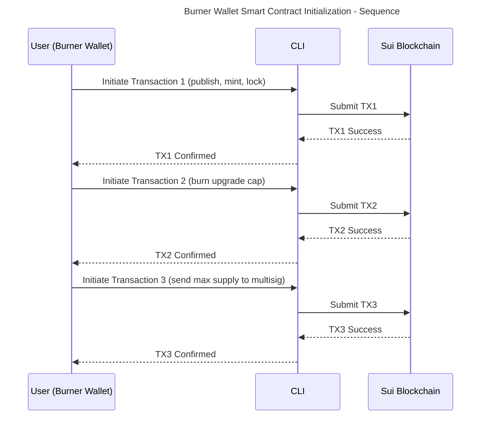

```mermaid
---
title: Burner Wallet Smart Contract Initialization - Sequence
---
sequenceDiagram
    participant U as User (Burner Wallet)
    participant CLI as CLI
    participant SUI as Sui Blockchain

    U->>CLI: Initiate Transaction 1 (publish, mint, lock)
    CLI->>SUI: Submit TX1
    SUI-->>CLI: TX1 Success
    CLI-->>U: TX1 Confirmed

    U->>CLI: Initiate Transaction 2 (burn upgrade cap)
    CLI->>SUI: Submit TX2
    SUI-->>CLI: TX2 Success
    CLI-->>U: TX2 Confirmed

    U->>CLI: Initiate Transaction 3 (send max supply to multisig)
    CLI->>SUI: Submit TX3
    SUI-->>CLI: TX3 Success
    CLI-->>U: TX3 Confirmed
```
