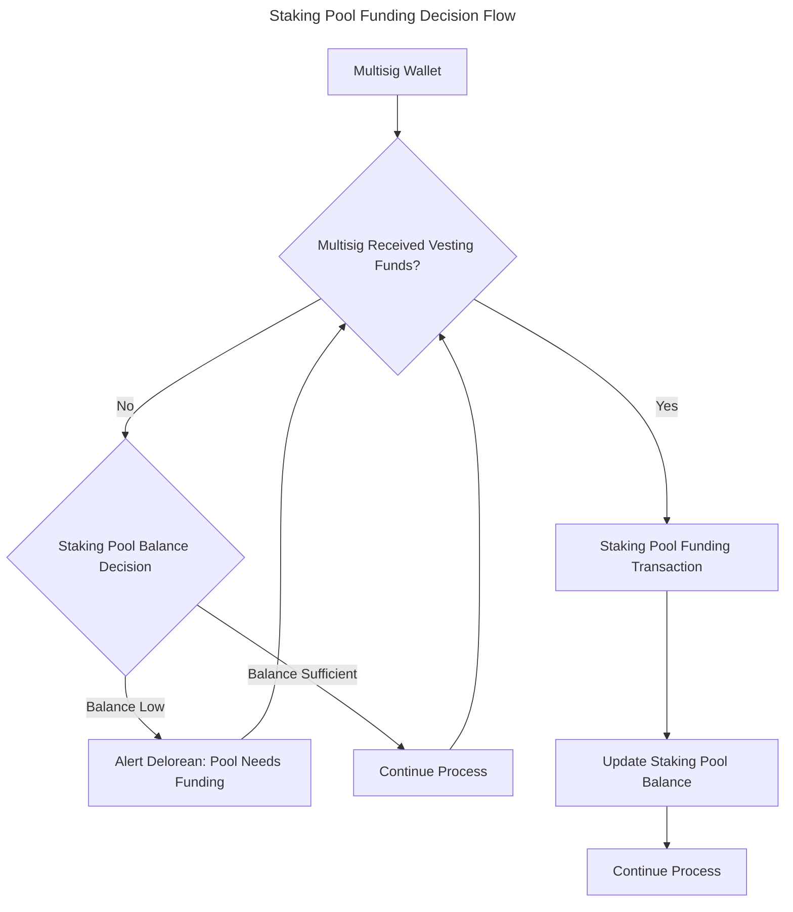

```mermaid
---
title: Staking Pool Funding Decision Flow
---
graph TD
    A[Multisig Wallet] --> B{Multisig Received Vesting Funds?}
    
    B -->|No| C{Staking Pool Balance Decision}
    B -->|Yes| D[Staking Pool Funding Transaction]
    
    C -->|Balance Low| E[Alert Delorean: Pool Needs Funding]
    C -->|Balance Sufficient| F[Continue Process]
    
    D --> G[Update Staking Pool Balance]
    G --> H[Continue Process]
    
    E --> B
    F --> B
```
