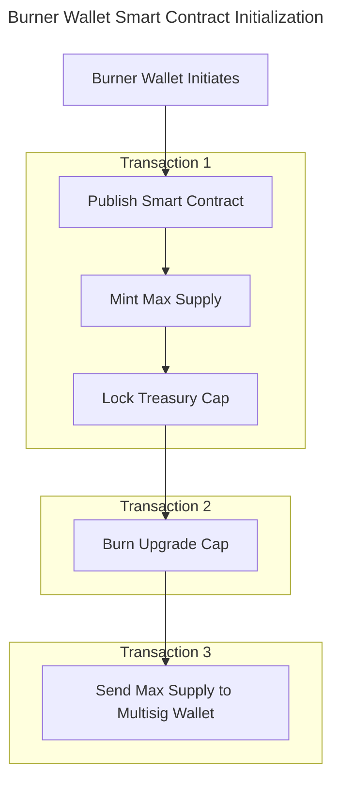

```mermaid
---
title: Burner Wallet Smart Contract Initialization
---
graph TD

    A[Burner Wallet Initiates] --> B

    subgraph TX1 [Transaction 1]
        B[Publish Smart Contract] --> C[Mint Max Supply] --> D[Lock Treasury Cap]
    end

    D --> G

    subgraph TX2 [Transaction 2]
        G[Burn Upgrade Cap]
    end

    G --> J

    subgraph TX3 [Transaction 3]
        J[Send Max Supply to Multisig Wallet]
    end
```
