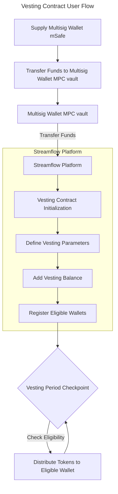

```mermaid
---
title: Vesting Contract User Flow
---
graph TD
    A[Supply Multisig Wallet mSafe] --> B[Transfer Funds to Multisig Wallet MPC vault]
    B --> C[Multisig Wallet MPC vault]
    
    C --> |Transfer Funds| D[Streamflow Platform]
    subgraph "Streamflow Platform"
    D --> E[Vesting Contract Initialization]
    E --> F[Define Vesting Parameters]
    F --> G[Add Vesting Balance]
    G --> H[Register Eligible Wallets]
    end
    
    H --> I{Vesting Period Checkpoint}
    I --> |Check Eligibility| J[Distribute Tokens to Eligible Wallet]
    J --> I
```
